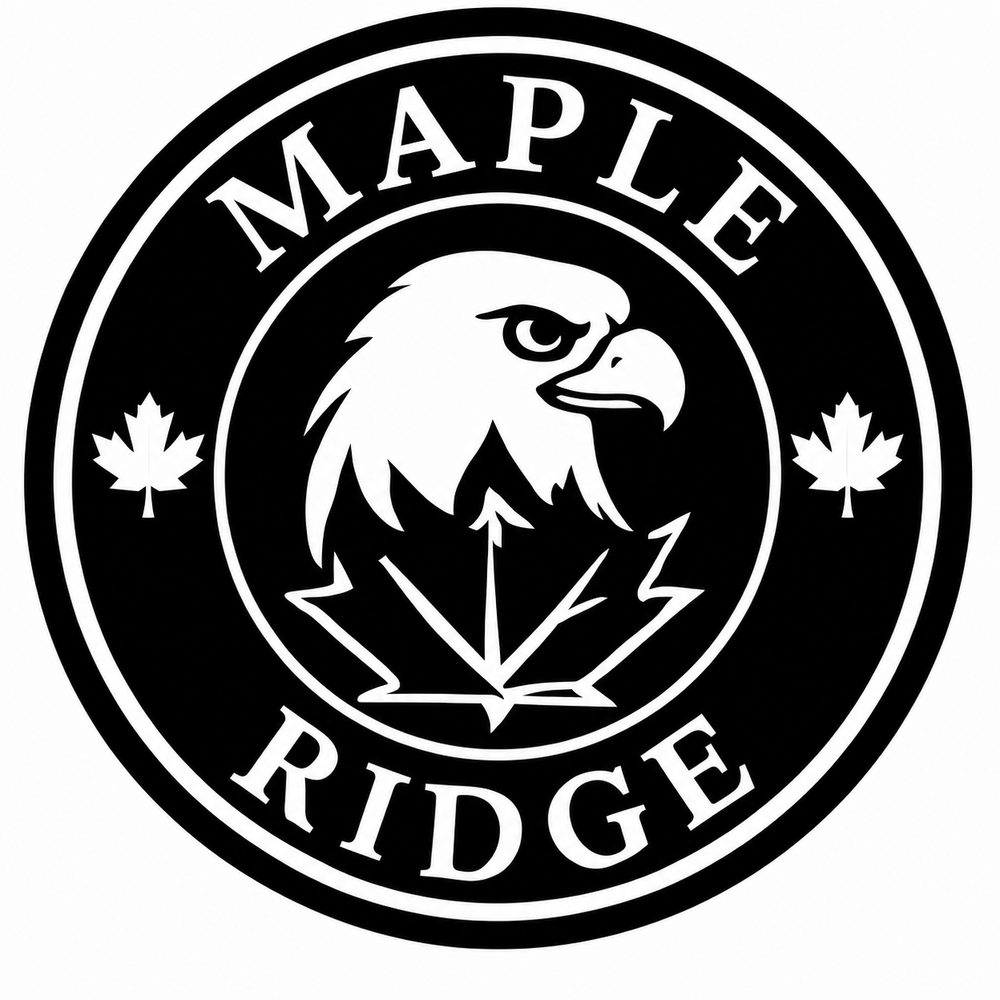

# Maple Ridge School Logo & Brand Resources

This page collects the Maple Ridge School Proud Eagle emblem and related files for school communications, documents, email signatures, labels, and maple syrup bottles.

---

## The Logo at a Glance

<div style="text-align:center;margin:1rem 0 1.5rem;">

</div>

The emblem combines four elements:

- **The eagle** — the central figure and strongest visual element.
- **The maple leaves** — a connection to the Maple Ridge name and the surrounding landscape.
- **The circular badge** — a format that works on documents, stickers, labels, and bottles.
- **MAPLE RIDGE** — the school name is part of the mark.

---

## Background & History of the Mark

<details>
<summary><strong>How the logo tells the Maple Ridge story</strong></summary>

The Maple Ridge mark was developed as a school identity rather than simply a decorative graphic. The goal was to create something that could work equally well on school communications, student materials, apparel, stickers, signage, and other everyday uses.

At the center is a proud eagle. The eagle gives the mark its sense of strength and character without requiring a complicated illustration. Its forward-facing profile creates a strong silhouette that remains recognizable when the logo is printed small.

The maple leaves reinforce the Maple Ridge name. They also keep the logo connected to place and school community rather than making it look like a generic sports emblem. This connection to place also suits the school's sugar bush and the maple syrup bottles that carry this label design.

</details>

<details>
<summary><strong>What the mark represents</strong></summary>

The emblem represents:

- **Strength** — we take our work and our community seriously.
- **Confidence** — students and staff should be comfortable representing their school.
- **Focus** — the eagle's expression gives the mark energy and purpose.

</details>

---

## Logo Files and Best Use

<details>
<summary><strong>PNG - transparent background</strong></summary>

<div style="position:relative;margin:1rem 0;text-align:center;background:#e6e6e6;padding:1rem;overflow:hidden;">

</div>

**Best for:** Email signatures, Outlook, PowerPoint, Word, documents, digital signage, and general staff use.

Use this version when the emblem needs to sit cleanly on a page, email, label, or bottle without a square background.

**Download:** [Maple Ridge emblem - transparent PNG](images/maple-ridge-emblem-transparent.png)

</details>

<details>
<summary><strong>PNG - original background</strong></summary>

<div style="margin:1rem 0;text-align:center;background:#f4f4f4;padding:1rem;">

</div>

**Best for:** Reference use or situations where the original background is required.

Use the transparent PNG instead for most staff materials.

**Download:** [Maple Ridge emblem - original PNG](images/maple-ridge-emblem-original.png)

</details>

<details>
<summary><strong>SVG - web and scalable graphics</strong></summary>

<div style="margin:1rem 0;text-align:center;background:#f4f4f4;padding:1rem;">

</div>

**Best for:** Web pages, SharePoint pages, HTML resources, and design tools that support SVG.

This is a true path-based vector version on a transparent background. It scales cleanly for web and other supported uses.

**Download:** [Maple Ridge emblem - SVG](images/maple-ridge-emblem-inverted.svg)

</details>

## Recommended Uses

| Use | Recommended file | Notes |
|---|---|---|
| Email signature | Transparent PNG | Best compatibility with Outlook and other mail clients. |
| Word / Office documents | Transparent PNG | General-purpose staff version. |
| SharePoint / web page | SVG or transparent PNG | Use SVG when the platform supports it; otherwise use PNG. |
| Stickers and school labels | Label Builder or transparent PNG | Use the dedicated round-label tool for Avery 94510. |
| Maple syrup bottles | Transparent PNG or label design | The circular label design is used on bottles from the school sugar bush. |
| Printing / design work | SVG or original PNG | Ask for the SVG when scalable artwork is needed. |

---

## Staff Email Signature

<details>
<summary><strong>Staff email signature generator</strong></summary>

**Generator:** [Create and copy a staff email signature](email-signature/maple-ridge-staff-signature-generator.html)

Enter the staff member's information in the generator, copy the rendered signature, and paste it into the email signature settings. The generator uses the original emblem PNG and is the only staff signature workflow in this package.

</details>

---

## Round Label / Back-to-School Gift Tool

<details>
<summary><strong>Avery 94510 round-label builder</strong></summary>

The label builder creates personalized 2¼-inch round labels using the Maple Ridge artwork with editable curved text. The design is also used on maple syrup bottles from the school's sugar bush. Use the tool for back-to-school gifts, student materials, and other labels where personalized curved text is needed.

**Open the label builder:** [Maple Ridge Welcome Label Builder](label-builder/mpr-welcome-labels-svg-round-v19.html)

> **Note:** Keep the label builder as a separate tool so it can be recalibrated without changing the official logo resource page.

</details>

---

## Logo Use Guidelines

<details>
<summary><strong>Keep the mark recognizable</strong></summary>

Please:

- Keep the eagle and maple leaves intact.
- Maintain the circular proportions.
- Scale the logo proportionally; do not stretch it vertically or horizontally.
- Use the original black-and-white version for standard school communications unless a specific approved variation is provided.

Avoid:

- Rebuilding the eagle from a screenshot.
- Changing the wording or substituting fonts inside the official logo.
- Stretching or squeezing the circular mark.
- Adding effects that make the eagle, leaves, or lettering difficult to recognize.
- Treating the label-specific **WELCOME / student-name** artwork as the official school logo.
- Replacing the official emblem with the personalized **WELCOME / student-name** artwork on maple syrup bottles or other school products.

</details>

---

## Download the Complete Resource Package

The package contains the Markdown resource, emblem files, staff signature generator, and the current label-builder tool.

**Package contents:**

```text
maple-ridge-logo-resources/
├── maple-ridge-logo-resources.md
├── images/
│   ├── maple-ridge-emblem-transparent.png
│   ├── maple-ridge-emblem-original.png
│   └── maple-ridge-emblem-inverted.svg
├── email-signature/
│   └── maple-ridge-staff-signature-generator.html
└── label-builder/
    ├── mpr-welcome-labels-svg-round-v19.html
    └── README.md
```

---

## Short Version for Staff

> The Maple Ridge School Proud Eagle emblem is used on school communications, labels, and maple syrup bottles from the school sugar bush.

Use the **transparent PNG** for email and general staff materials. Use the **SVG** for web and scalable graphics.

---

## Resource Ownership

This page is intended to be the staff-facing home for Maple Ridge School logo resources. If a logo file or template is updated, update the package here so staff have one place to find the current approved resources.
